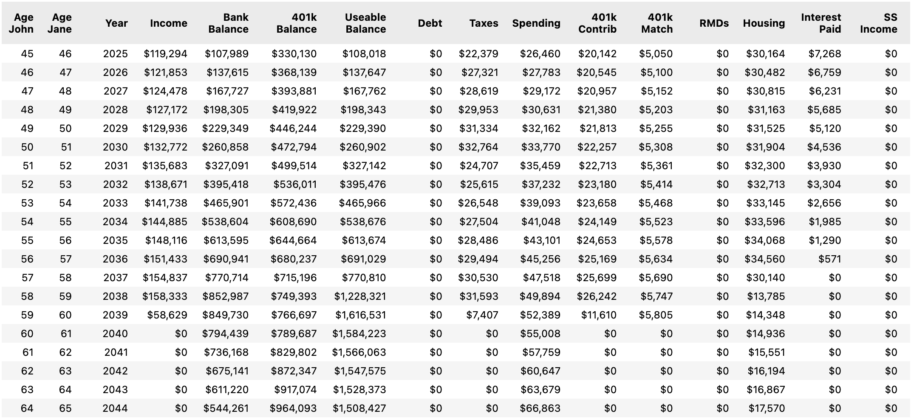
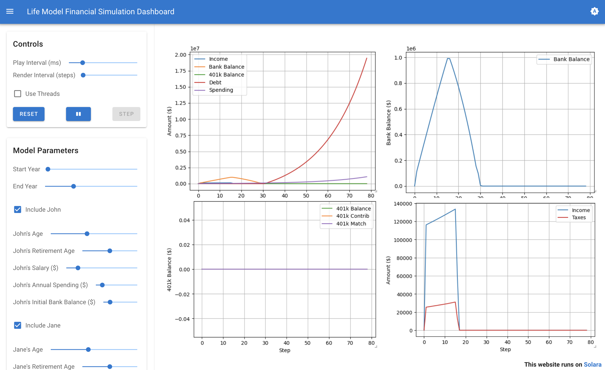

# life-model (beta)
Python package for performing time step-based simulations of personal finances. Note that this package is still early in development and likely contains bugs. Use at your own risk!

## Overview
The package provides comprehensive models of people, jobs, accounts, insurance, debt, and more within a time step-based simulation framework. Built on the [Mesa](https://github.com/projectmesa/mesa) agent-based modeling framework, it includes an interactive dashboard, an example Jupyter Notebook, deep reinforcement learning capabilities for AI-driven financial planning, and can be used programmatically for in-depth financial studies.

## Key Features
- **Comprehensive Financial Modeling**: Model families, individuals, jobs, various account types, insurance policies, debt, taxes, and more
- **Interactive Dashboard**: Web-based interface using Solara for real-time financial simulations and visualizations
- **Deep Learning Integration**: Train AI agents using deep Q-learning to optimize financial decision-making
- **Flexible Configuration**: YAML-based configuration system for different economic scenarios

## Motivation
While impossible to predict the future, the goal of this package is to provide a robust framework for modeling financial outcomes based on various inputs. The best way to use this model is to change one variable at a time and evaluate how it impacts the outcome.

## Getting Started

### Quick Start
Check out the example simulation notebook:
- [Google Colab (interactive)](https://colab.research.google.com/github/sw23/life-model/blob/main/ExampleSimulation.ipynb)
- [GitHub](https://github.com/sw23/life-model/blob/main/ExampleSimulation.ipynb)



### Installation
```bash
python -m pip install life-model
```

### Interactive Dashboard
For a web-based interface to run simulations:
```bash
pip install -e . -r dashboard/requirements-dash.txt
solara run dashboard/app.py
```
Then open your browser to http://localhost:8765



### Deep Reinforcement Learning
Train AI agents to make optimal financial decisions:
```bash
pip install -r deepqlearning/requirements-rl.txt
python deepqlearning/train_financial_agent.py --scenario basic --episodes 1000
```

## Modeling Status
This package supports a comprehensive range of financial modeling components:

### Core Components
- [x] **Family & Person Models** - Multi-person households with individual financial profiles
- [ ] **Children** - Dependents with education and care costs
- [x] **Jobs** - Employment with salary progression and benefits

### Accounts & Investments
- [x] **Bank Accounts** - Checking/savings with interest
- [x] **401k Plans** - Traditional and Roth with employer matching
- [x] **Traditional & Roth IRAs** - Individual retirement accounts
- [x] **HSA** - Health Savings Accounts
- [ ] **529 Plans** - Education savings accounts
- [x] **Brokerage Accounts** - Taxable investment accounts
- [ ] **Pensions** - Defined benefit retirement plans

### Insurance & Protection
- [x] **Life Insurance** - Term and whole life policies with loans
- [x] **General Insurance** - Health, auto, home, umbrella insurance
- [x] **Annuities** - Fixed and variable annuities with various payout options
- [x] **Social Security** - Comprehensive benefit calculations with timing strategies

### Debt Management
- [x] **Student Loans** - Education debt with various repayment options
- [x] **Car Loans** - Auto financing
- [x] **Credit Cards** - Revolving debt with interest calculations
- [x] **Mortgages** - Home loans (integrated with housing model)

### Tax System
- [x] **Federal Taxes** - Complete income tax calculations with brackets
- [ ] **State Taxes** - Configurable state tax rates (basic flat rate only)
- [x] **FICA Taxes** - Social Security and Medicare taxes
- [x] **Required Minimum Distributions (RMDs)** - Retirement account distributions

### Housing & Lifestyle
- [x] **Home Ownership** - Purchase, mortgage, appreciation, and selling
- [x] **Rental Housing** - Apartment leasing with rent increases
- [x] **Life Events** - Marriage, retirement, career changes

### Giving & Legacy
- [ ] **Charitable Giving** - Tax-deductible donations
- [ ] **Donor Advised Funds** - Charitable investment accounts

### Advanced Features
- [x] **Economic Scenarios** - Configurable market conditions (recession, inflation, etc.)
- [x] **Payment Services** - Intelligent bill payment with account prioritization
- [x] **Tax Optimization** - Strategic withdrawal and contribution planning
- [x] **Deep Q-Learning** - AI-driven financial decision optimization

## Examples and Documentation

### Dashboard
The interactive dashboard provides real-time visualization of financial simulations with parameter controls for:
- Family member configuration (age, salary, retirement age)
- Economic factors (inflation, salary growth)
- Account balances and debt management
- Tax and spending analysis

### Reinforcement Learning
The deep learning module includes:
- Pre-configured training scenarios (basic, high_earner, low_earner)
- 20+ financial actions for AI agents to learn
- Customizable reward functions for different objectives
- Training visualization and model evaluation tools

### Configuration System
YAML-based configuration files in `/config/scenarios/` allow modeling of different economic conditions:
- `conservative.yaml` - Low growth, stable conditions
- `aggressive.yaml` - High growth, volatile markets
- `recession.yaml` - Economic downturn scenarios
- `high_inflation.yaml` - Inflationary environment modeling

## Contributing
This project is open source and welcomes contributions. Please see the test suite in `src/life_model/tests/` for examples of expected functionality and to ensure your changes don't break existing features.

## License
This project is licensed under the MIT License. See the [LICENSE](LICENSE) file for details.

## How to Cite
If you use this package in your research, please cite it as follows:
```bibtex
@software{life_model,
  author = {Spencer Williams},
  title = {life-model: Personal Finance Simulation Framework},
  url = {https://github.com/sw23/life-model},
  version = {0.0.0},
  year = 2025
}
```
